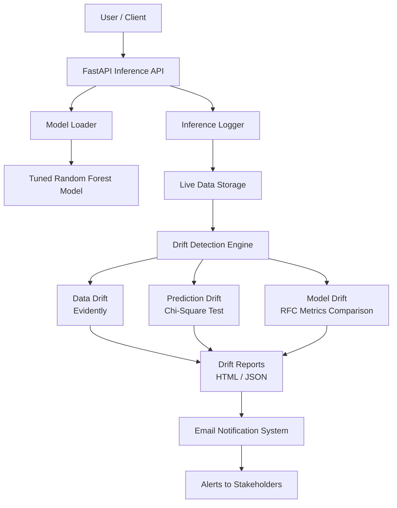

# 📊 Telecom Customer Churn Prediction – End-to-End MLOps System

An end-to-end **Machine Learning and MLOps** project that predicts customer churn using the **Telecom Customer Churn dataset**, covering the complete ML lifecycle including **model experimentation, tracking, deployment, drift monitoring, and automated alerting**.

This project focuses not only on building a high-performing model but also on solving **real-world production challenges** such as data drift, prediction drift, and model drift.

---

## 📌 Problem Statement

Customer churn prediction identifies customers who are likely to stop using a service.  
The dataset used in this project is **highly imbalanced**, making accuracy-only evaluation misleading and requiring careful metric selection and continuous monitoring.

---

## 📂 Dataset

- **Dataset**: Telecom Customer Churn  
- **Source**: Kaggle *(https://www.kaggle.com/datasets/blastchar/telco-customer-churn)*  
- **Target Variable**: `Churn`  
- **Key Challenge**: Severe class imbalance  

---

## 🧠 Project Methodology

### 1️⃣ Exploratory Data Analysis & Preprocessing
- Performed detailed exploratory data analysis using multiple visualization techniques
- Analyzed feature distributions, correlations, and imbalance
- Applied multiple encoding strategies for categorical features
- Handled missing values and inconsistent data types

---

### 2️⃣ Model Experimentation
- Trained multiple baseline machine learning models
- Compared performance using **precision, recall, and F1-score**
- Avoided random model selection by running structured experiments

---

### 3️⃣ Hyperparameter Tuning
- Tuned selected models using **RandomizedSearchCV**
- Compared baseline vs tuned models
- Identified the best model based on imbalance-aware metrics

---

### 4️⃣ Experiment Tracking with MLflow
- Tracked all experiments using **MLflow**
- Logged model parameters, evaluation metrics, and model artifacts
- Compared experiments visually in the MLflow UI
- **Tuned Random Forest Classifier** performed best

✅ **Final model used in production: Tuned Random Forest Classifier**

---

## 🏗 System Architecture

The following diagram illustrates the complete architecture, including inference, monitoring, and alerting.



## 🚀 Model Serving & Applications

### 🔹 Streamlit (Initial Stage)
- Built a **Streamlit application** for:
  - Interactive predictions
  - Quick validation of model behavior

### 🔹 FastAPI (Production-ready)
- Implemented a **FastAPI backend** for:
  - Scalable inference
  - API-based predictions
- Designed to support future extensions like:
  - Segment-wise reports
  - A/B testing endpoints

---

## 📉 Drift Monitoring & MLOps

One of the core highlights of this project is **post-deployment monitoring**.

### 🔍 Drift Types Implemented

#### ✅ Data Drift
- Implemented using **Evidently**
- Detects feature distribution shifts between:
  - Reference (training) data
  - Live production data
- Generates **HTML + JSON reports**
- Reports are automatically saved

#### ✅ Prediction Drift
- Implemented using **Chi-Square statistical test**
- Detects shifts in prediction distribution over time

#### ✅ Model Drift
- Uses the **final tuned Random Forest model**
- Monitors degradation in model behavior due to data changes

---

### 📧 Automated Alerts
- If **any drift is detected**:
  - An **email alert is automatically triggered**
  - Drift reports are **attached to the email**
- SMTP credentials handled securely using environment variables

---

## ☁️ Deployment

- Deployed on **Render**
- Uses:
  - Environment variables
  - Secure secrets management
- Supports:
  - Automatic scaling
  - Continuous availability

Deployment link: *(https://churn-prediction-ml-zvrg.onrender.com/predict)*

---

## 🗂 Project Structure
```
.
├── artifacts
│   └── rfc_tuned_model.joblib
├── config
│   ├── schemas.yaml
│   └── settings.py
├── data
│   ├── incoming
│   │   └── live_data.csv
│   └── reference
│       └── WA_Fn-UseC_-Telco-Customer-Churn.csv
├── drift_runners
│   └── run_drift.py
├── fastapi_app.py
├── helper.py
├── notebooks
│   └── experiment-notebook.ipynb
├── render.yaml
├── requirements.txt
├── src
│   ├── core
│   ├── logging
│   ├── monitoring
│   │   ├── drift_jobs
│   │   ├── reports_builder
│   │   ├── handling_drift
│   │   └── email_notifications
│   └── utils
├── streamlit_app.py
├── templates
│   └── index.html
└── test.py
```

---

## 🛠 Tech Stack

- **Python**
- **Scikit-learn**
- **MLflow**
- **FastAPI**
- **Streamlit**
- **Evidently**
- **Pandas, NumPy, Matplotlib**
- **Render (Deployment)**

---

## 🔮 Future Enhancements

Planned extensions include:
- **Segment-wise drift reports**
- **A/B testing**
  - Threshold tuning at model level
  - Threshold tuning at feature level
- Advanced business-driven monitoring metrics

---

## 👨‍💻 Author

**Reddy Rohith Kosinepalli**    


