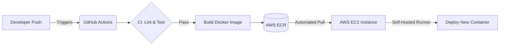
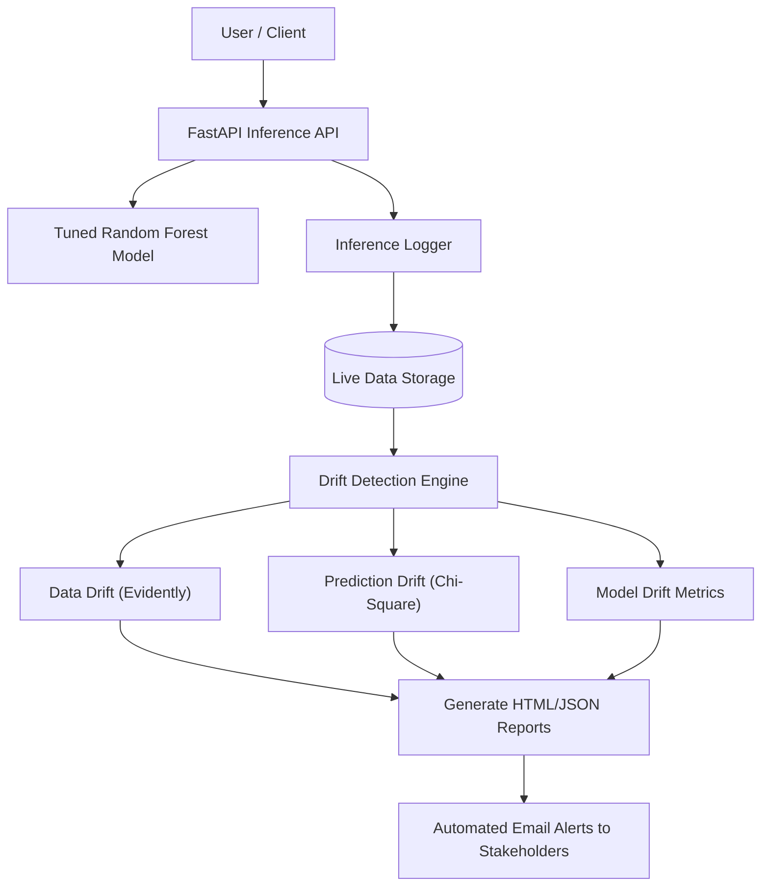

# 📊 Telecom Customer Churn Prediction – End-to-End MLOps System

An end-to-end **Machine Learning and MLOps** production system that predicts customer churn using the **Telecom Customer Churn dataset**. This project moves beyond static model training, covering the complete ML lifecycle: **model experimentation, tracking, containerization, automated CI/CD deployment to AWS, live drift monitoring, and automated alerting**.

This project focuses on solving **real-world production challenges** securely and scalably.

---

## 📌 Problem Statement

Customer churn prediction identifies users who are likely to stop using a service, a critical metric for business retention. The dataset used is **highly imbalanced**, meaning relying solely on accuracy is dangerously misleading. This project utilizes imbalance-aware metrics (F1, Precision-Recall) and extensive continuous monitoring to ensure the model behaves correctly in reality, not just in a notebook.

---

## 🏗 System & MLOps Architecture

The architecture is explicitly broken down into two core pipelines: **1) The CI/CD Deployment Pipeline** and **2) The Inference & Monitoring Pipeline**.

### 1️⃣ Automated CI/CD Pipeline (AWS & Docker)

Whenever new code is pushed to the `main` branch, a fully automated GitHub Actions pipeline guarantees zero-downtime deployment to AWS cloud infrastructure.


```mermaid
flowchart LR
    A[Developer Push] -->|Triggers| B(GitHub Actions)
    B --> C{CI: Lint & Test}
    C -- Pass --> D[Build Docker Image]
    D --> E[(AWS ECR)]
    E -->|Automated Pull| F[AWS EC2 Instance]
    F -->|Self-Hosted Runner| G[Deploy New Container]
```

### 2️⃣ Live Inference & Drift Monitoring Pipeline

Live predictions are served via a FastAPI backend, while an asynchronous cron/job system continuously checks incoming data for statistical drift, ensuring the model doesn't degrade silently over time.


```mermaid
flowchart TD
    A[User / Client] --> B[FastAPI Inference API]
    B --> C[Tuned Random Forest Model]
    B --> E[Inference Logger]
    E --> F[(Live Data Storage)]
    F --> G[Drift Detection Engine]
    
    G --> H["Data Drift (Evidently)"]
    G --> I["Prediction Drift (Chi-Square)"]
    G --> J["Model Drift Metrics"]
    
    H & I & J --> K[Generate HTML/JSON Reports]
    K --> L[Automated Email Alerts to Stakeholders]
```

---

## ☁️ Infrastructure & Deployment

This project models a true enterprise-grade deployment, utilizing cloud-native services to guarantee uptime, security, and reproducibility.

- **Containerization (Docker)**: The entire FastAPI backend and ML environment is encapsulated in a Docker container, guaranteeing code runs identically on a local laptop and in the cloud.
- **AWS Elastic Container Registry (ECR)**: Serves as the private, secure storage vault for all versioned production Docker images.
- **AWS EC2 (Elastic Compute Cloud)**: The primary host machine serving the live model. It runs an isolated **GitHub Actions Self-Hosted Runner** operating continuously in the background as a service.
- **Continuous Deployment**: When the CI/CD pipeline finishes pushing to ECR, it reaches out to the EC2 Self-Hosted Runner, which autonomously handles shutting down the old container, purging unused cache to save disk space, and spinning up the latest version securely.
- **AWS IAM**: Strictly scoped Identity and Access Management policies ensure the GitHub workflow can exactly push/pull images and nothing else.

---

## 📉 Detect, Alert, Resolve: Post-Deployment Monitoring

Deploying a model is only 20% of the battle. The core feature of this system is **post-deployment monitoring**.

* **Data Drift (Evidently)**: Detects statistical distribution shifts between the original training reference data and live production data.
* **Prediction Drift**: Employs Chi-Square tests to heavily monitor if the model is suddenly predicting "Churn" 40% of the time instead of the baseline 20%.
* **Automated Alerting**: The moment the background engine detects standard deviation violations, the system programmatically generates drift reports and secures SMTP credentials to fire an **Email Alert directly to stakeholders**, catching silent AI failures instantly.

---

## 🚀 Getting Started (How to Run Locally)

You can run this project locally on your machine either natively via Python or via Docker.

### Option 1: Native Python Setup

1. **Clone the repository:**
   ```bash
   git clone https://github.com/reddyrohith49471/Churn_Prediction_ML.git
   ```
2. **Create a virtual environment & install dependencies:**
   ```bash
   python3 -m venv venv
   source venv/bin/activate  # On Windows: venv\Scripts\activate
   pip install -r requirements.txt
   ```
3. **Run the FastAPI Server:**
   ```bash
   uvicorn fastapi_app:app --host 0.0.0.0 --port 8000 --reload
   ```
   *The API will be live at `http://localhost:8000/docs` (Interactive Swagger UI).*

### Option 2: Docker Setup (Recommended)

1. **Build the Docker Image:**
   ```bash
   docker build -t churn-prediction-app .
   ```
2. **Run the Container:**
   ```bash
   docker run -d -p 8090:8000 --name mltest churn-prediction-app
   ```
   *The API will be live at `http://localhost:8090/docs`.*

---

## 🛠 Tech Stack

| Category | Technologies |
| :--- | :--- |
| **Machine Learning** | Scikit-learn, Pandas, NumPy, Matplotlib |
| **Experiment Tracking** | MLflow |
| **Backend & Serving** | FastAPI, Uvicorn, Python 3.12 |
| **Monitoring & Drift** | Evidently AI, SciPy (Statistical Tests), SMTP Alerting |
| **DevOps & Cloud** | AWS EC2, AWS ECR, AWS IAM, Docker, GitHub Actions |
| **Frontend/Validation** | Streamlit (Initial Stage Testing) |

---


